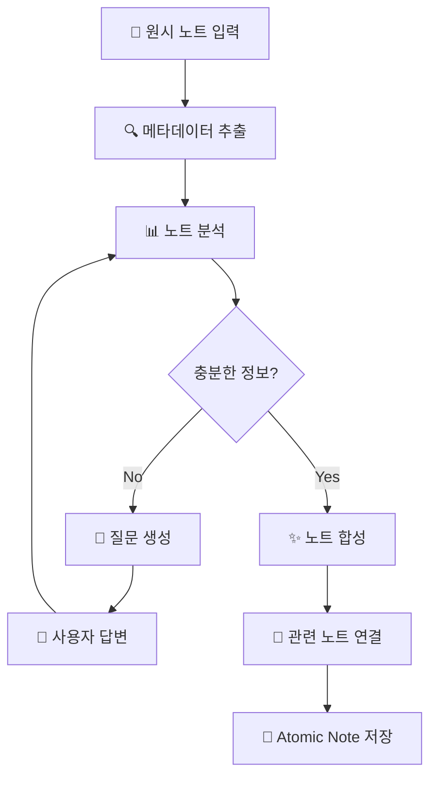

# 🧠 Atomic Note Architect (ANA)

<p align="center">
  
  
  
  
</p>

<p align="center">
  <strong>원시(Raw) 노트를 Zettelkasten 원칙에 부합하는 Atomic Note로 변환하는 AI 에이전트</strong>
</p>

> 💡 **핵심 철학**: 단순히 텍스트를 요약하거나 나누는 것이 아니라, 사용자의 **'생각을 확장(Expansion)'** 시키고, **'맥락(Context)'** 을 완성하여, Second Brain에서 다른 지식과 유기적으로 연결될 수 있는 **'완결성 있는 지식 블록'** 을 만듭니다.

---

## 📋 목차

- [✨ 주요 기능](#-주요-기능)
- [🚀 빠른 시작](#-빠른-시작)
- [📦 설치 방법](#-설치-방법)
- [⚙️ 설정](#️-설정)
- [💻 사용법](#-사용법)
- [🔌 Obsidian 플러그인](#-obsidian-플러그인)
- [🏗️ 아키텍처](#️-아키텍처)
- [❓ FAQ](#-faq)
- [🤝 기여하기](#-기여하기)

---

## ✨ 주요 기능

### 🎯 3단계 AI 파이프라인

```
📝 원시 노트 → 🔍 분석 → 💬 심문 → ✨ 합성 → 📄 Atomic Note
```

| 단계 | 설명 |
|------|------|
| **1. 분석 (Analysis)** | 복합적인 주제를 개별 개념으로 분리하고, 정보량이 충분한지 판단 |
| **2. 심문 (Interrogation)** | 최대 5개의 심층 질문을 통해 암묵지(Tacit Knowledge) 추출 |
| **3. 합성 (Synthesis)** | 답변을 자연스럽게 통합하여 완결된 Atomic Note 생성 |

### 🔗 지능형 노트 연결 (Auto-Linking)

- **2-Stage Retrieval + Rerank 아키텍처**
  - Stage 1: 태그/카테고리 + 키워드(BM25) + 임베딩 유사도
  - Stage 2: Cross-Encoder로 정밀 재순위
- Vault 내 기존 노트는 `[[Title]]`, 새로운 노트는 `[[Title (new)]]`로 자동 구분

### 📝 스마트 노트 분할

다중 개념이 혼재된 노트를 자동 감지하여 분리 제안:

```
📥 입력: "RAG는 검색 증강 생성이다. GraphRAG도 있더라."
    ↓
📤 출력: 
    - RAG-검색-증강-생성.md
    - GraphRAG-개요.md
```

### 🌐 다국어 지원

- 한글 중심 작성 (설명, 문장)
- 전문 기술 용어는 영어 원문 유지 (RAG, LLM, API 등)

### 📁 메타데이터 보존

- 기존 Frontmatter 완전 보존
- AI가 자동으로 새로운 메타데이터 확장

### � 적응형 템플릿

- 카테고리별 맞춤형 템플릿 자동 적용
- 우선순위: 파일 템플릿 → DB 템플릿 → AI 생성

---

## 🚀 빠른 시작

### 1️⃣ 설치

```bash
# 저장소 클론
git clone https://github.com/your-repo/ana.git
cd ana

# 의존성 설치 (uv 사용)
uv sync
```

### 2️⃣ 환경 설정

```bash
# 환경 변수 파일 복사
cp .env.example .env

# .env 파일 편집
nano .env  # 또는 선호하는 편집기 사용
```

필수 설정:
```bash
# API 키 (OpenAI, Anthropic 중 선택)
OPENAI_API_KEY=sk-your-api-key-here

# Obsidian Vault 경로
ANA_VAULT_PATH=~/Documents/Obsidian/MyVault
```

### 3️⃣ 실행

```bash
# 대화형 설정 마법사 (처음 사용시 권장)
ana config init

# 새 노트 생성
ana new
```

---

## 📦 설치 방법

### 요구사항

| 항목 | 최소 요구사항 |
|------|--------------|
| **Python** | 3.10 이상 |
| **패키지 매니저** | [uv](https://docs.astral.sh/uv/) (권장) 또는 pip |
| **LLM API** | OpenAI / Anthropic / Ollama / vLLM 중 하나 |
| **Obsidian** | 기존 Vault (노트 연결 기능 사용 시) |

### uv로 설치 (권장)

```bash
# uv 설치 (미설치 시)
curl -LsSf https://astral.sh/uv/install.sh | sh

# 프로젝트 설치
uv sync
```

### pip로 설치

```bash
pip install -e .
```

---

## ⚙️ 설정

### LLM Provider 설정

#### OpenAI (기본)
```bash
ANA_LLM_PROVIDER=openai
OPENAI_API_KEY=sk-proj-...
ANA_LLM_MODEL=gpt-4o     # 또는 gpt-4o-mini
```

#### Anthropic (Claude)
```bash
ANA_LLM_PROVIDER=anthropic
ANTHROPIC_API_KEY=sk-ant-...
ANA_LLM_MODEL=claude-3-5-sonnet-20241022
```

#### Ollama (로컬, 무료)
```bash
ANA_LLM_PROVIDER=ollama
ANA_OLLAMA_BASE_URL=http://localhost:11434
ANA_OLLAMA_MODEL=llama3.1:8b
```

> 💡 **Tip**: Ollama를 사용하면 API 비용 없이 로컬에서 실행할 수 있습니다.  
> 설치: `ollama pull llama3.1:8b`

#### vLLM (고성능 로컬)
```bash
ANA_LLM_PROVIDER=vllm
ANA_VLLM_BASE_URL=http://localhost:8000/v1
ANA_VLLM_MODEL=meta-llama/Llama-3.1-8B-Instruct
```

### 임베딩 및 노트 연결 설정

```bash
# 임베딩 모델 (Ollama 사용)
ANA_EMBEDDING_PROVIDER=ollama
ANA_EMBEDDING_MODEL=nomic-embed-text

# Rerank 모델 (문장 유사도 재순위)
ANA_RERANK_MODEL=cross-encoder/ms-marco-MiniLM-L-6-v2
ANA_RERANK_ENABLED=true

# 관련 노트 최대 개수
ANA_MAX_RELATED_LINKS=5
```

### 에이전트 설정

```bash
# 라운드당 최대 질문 수
ANA_MAX_QUESTIONS=5

# 최대 질문 라운드 수
ANA_MAX_ITERATIONS=3
```

---

## 💻 사용법

### CLI 명령어

```bash
# 도움말
ana --help

# 새 노트 생성 (대화형)
ana new

# 특정 파일 처리
ana process raw_note.txt

# 출력 디렉토리 지정
ana new --output ~/vault/notes/

# 비대화형 모드 (질문 건너뛰기)
ana new --no-interactive

# 임베딩 동기화
ana sync
```

### 설정 관리

```bash
# 대화형 설정 마법사
ana config init

# 현재 설정 확인
ana config show

# 개별 설정 변경
ana config set llm_provider ollama
ana config set vault_path ~/Documents/Obsidian
```

### 환경 진단

```bash
# 환경 및 설정 진단
ana doctor
```

### Python API

```python
from src.agent import AtomicNoteArchitect
from src.config import ANAConfig

# 에이전트 초기화
config = ANAConfig()
agent = AtomicNoteArchitect(config)

# 원시 노트 처리
raw_note = """
RAG는 검색 증강 생성의 약자다.
LLM의 환각 문제를 해결하기 위해 사용한다.
"""

response = agent.process(raw_note)

# 질문이 있으면 답변 제공
if response.status == "needs_info":
    print("Questions:", response.interaction.questions_to_user)
    answers = ["실제 프로젝트에서 사용 중", "정확도 향상이 주요 목표"]
    response = agent.answer_questions(answers)

# 최종 노트 저장
saved_path = agent.save_note(response.draft_note)
print(f"Saved to: {saved_path}")
```

---

## 🔌 Obsidian 플러그인

Obsidian 내에서 직접 ANA를 사용할 수 있는 플러그인입니다.

### 설치

```bash
# 1. API 서버 시작 (터미널에서)
ana serve

# 2. 플러그인 빌드
cd obsidian-ana-plugin
npm install && npm run build

# 3. 플러그인을 Vault에 복사
mkdir -p ~/Obsidian/.obsidian/plugins/ana-atomic-note-architect
cp main.js manifest.json styles.css ~/Obsidian/.obsidian/plugins/ana-atomic-note-architect/

# 4. Obsidian 재시작 후 설정 > 커뮤니티 플러그인에서 활성화
```

### 사용법

1. 터미널에서 `ana serve`로 서버 시작
2. Obsidian에서 노트 열기
3. `Ctrl/Cmd + P` → "ANA: Process Current Note" 선택
4. 모달에서 질문에 답변
5. 미리보기 확인 후 저장

### 사용 가능한 명령어

| 명령어 | 설명 |
|--------|------|
| `ANA: Process Current Note` | 현재 노트 전체 처리 |
| `ANA: Process Selected Text` | 선택한 텍스트만 처리 |
| `ANA: Check Server Connection` | 서버 연결 확인 |

---

## 🏗️ 아키텍처

### 프로젝트 구조

```
ana/
├── src/
│   ├── agent.py              # 메인 에이전트 클래스
│   ├── graph.py              # LangGraph 워크플로우
│   ├── config.py             # 설정 관리
│   ├── schemas.py            # Pydantic 데이터 모델
│   ├── prompts.py            # LLM 프롬프트
│   ├── vault_scanner.py      # Obsidian Vault 스캐너
│   ├── category_classifier.py # 카테고리 분류기
│   ├── template_manager.py   # 템플릿 관리
│   ├── link_analyzer.py      # 노트 연결 분석기
│   ├── embedding_cache.py    # 임베딩 캐시
│   ├── llm_config.py         # LLM 프로바이더 설정
│   ├── cli/                  # CLI 모듈
│   │   ├── main.py           # Click CLI 진입점
│   │   ├── commands.py       # 서브커맨드
│   │   ├── config_wizard.py  # 설정 마법사
│   │   └── doctor.py         # 환경 진단
│   └── api/                  # FastAPI 서버
│       ├── server.py         # API 서버
│       └── schemas.py        # API 스키마
├── obsidian-ana-plugin/      # Obsidian 플러그인 (TypeScript)
├── templates/                # 노트 템플릿
├── data/                     # 템플릿 DB, 임베딩 캐시
├── .env.example              # 환경 변수 템플릿
└── pyproject.toml            # 프로젝트 설정
```

### 워크플로우 다이어그램



### 기술 스택

| 컴포넌트 | 기술 |
|----------|------|
| **워크플로우** | LangGraph |
| **LLM 통합** | LangChain |
| **데이터 검증** | Pydantic |
| **임베딩** | Ollama (nomic-embed-text) |
| **Rerank** | sentence-transformers (Cross-Encoder) |
| **CLI** | Click + Rich |
| **API** | FastAPI |

---

## ❓ FAQ

### Q: Obsidian Vault 경로는 어떻게 찾나요?

Obsidian 앱에서 **설정 > 파일 및 링크 > Vault 위치**에서 확인하거나, `.obsidian` 폴더가 있는 디렉토리가 Vault 경로입니다.

### Q: API 키 없이 사용할 수 있나요?

네! [Ollama](https://ollama.ai/)를 설치하면 로컬에서 무료로 사용 가능합니다:

```bash
# Ollama 설치 후
ollama pull llama3.1:8b
ollama pull nomic-embed-text  # 임베딩용

# .env 설정
ANA_LLM_PROVIDER=ollama
```

### Q: 질문 없이 바로 노트를 생성하려면?

```bash
ana new --no-interactive
```

또는 대화형 모드에서 질문에 빈 답변(`Enter`)을 입력하세요.

### Q: 노트 연결 기능을 끄려면?

```bash
ANA_ENABLE_NOTE_LINKING=false
```

### Q: 예제 노트로 테스트하려면?

```bash
ana process examples/sample_note.txt
```

---

## 🤝 기여하기

버그 리포트, 기능 제안, PR을 환영합니다!

```bash
# 개발 환경 설치
uv sync --group dev

# 테스트 실행
pytest

# 린트 검사
ruff check src/
```

---

## 📜 라이선스

MIT License - 자유롭게 사용, 수정, 배포할 수 있습니다.

---

<p align="center">
  Made with ❤️ for Knowledge Architects
</p>
