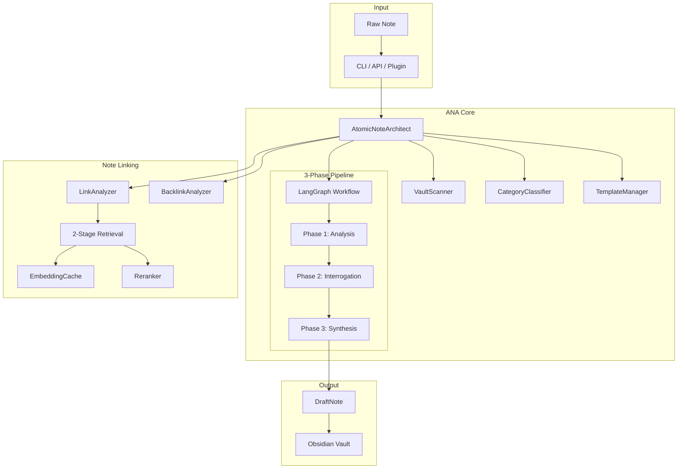
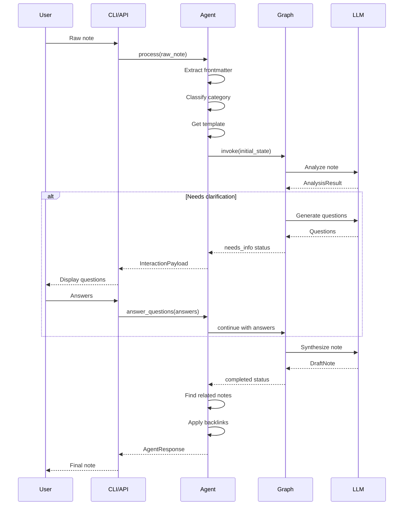
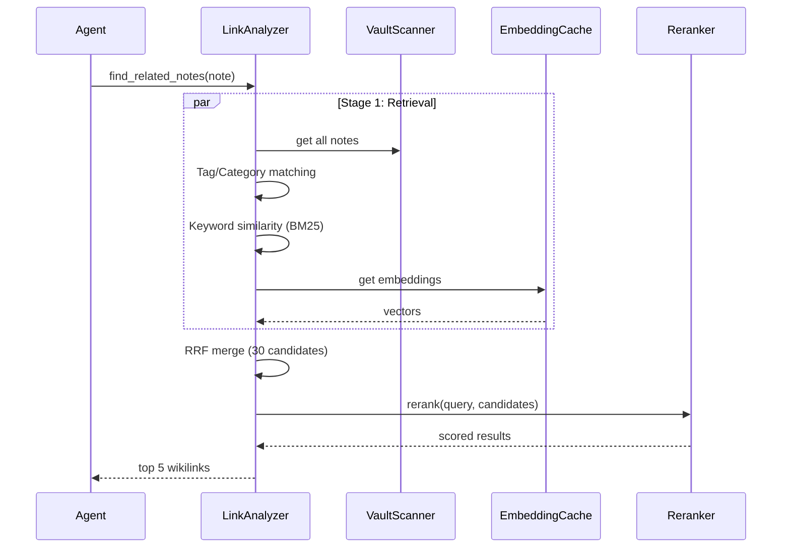

# ANA Architecture

> Atomic Note Architect - AI-powered Zettelkasten note transformation system

## System Overview



## Module Dependencies

```mermaid
graph LR
    agent[agent.py] --> graph[graph.py]
    agent --> config[config.py]
    agent --> llm_config[llm_config.py]
    agent --> vault_scanner[vault_scanner.py]
    agent --> category_classifier[category_classifier.py]
    agent --> template_manager[template_manager.py]
    agent --> link_analyzer[link_analyzer.py]
    agent --> backlink_analyzer[backlink_analyzer.py]
    agent --> embedding_cache[embedding_cache.py]
    
    graph --> schemas[schemas.py]
    graph --> prompts[prompts.py]
    
    link_analyzer --> embedding_cache
    link_analyzer --> vault_scanner
    
    backlink_analyzer --> vault_scanner
    backlink_analyzer --> schemas
```

## Data Flow

### Note Processing Flow



### Note Linking Flow



## Key Components

### Core Modules

| Module | Purpose |
|--------|---------|
| [agent.py](file:///home/shkim/workspace/04.ANA/src/agent.py) | Main orchestrator, manages pipeline |
| [graph.py](file:///home/shkim/workspace/04.ANA/src/graph.py) | LangGraph workflow definition |
| [schemas.py](file:///home/shkim/workspace/04.ANA/src/schemas.py) | Pydantic data models |
| [config.py](file:///home/shkim/workspace/04.ANA/src/config.py) | Configuration management |
| [llm_config.py](file:///home/shkim/workspace/04.ANA/src/llm_config.py) | LLM provider abstraction |

### Note Linking

| Module | Purpose |
|--------|---------|
| [link_analyzer.py](file:///home/shkim/workspace/04.ANA/src/link_analyzer.py) | 2-Stage Retrieval + Rerank |
| [backlink_analyzer.py](file:///home/shkim/workspace/04.ANA/src/backlink_analyzer.py) | Bidirectional link discovery |
| [embedding_cache.py](file:///home/shkim/workspace/04.ANA/src/embedding_cache.py) | Incremental embedding storage |

### Utilities

| Module | Purpose |
|--------|---------|
| [vault_scanner.py](file:///home/shkim/workspace/04.ANA/src/vault_scanner.py) | Obsidian vault traversal |
| [category_classifier.py](file:///home/shkim/workspace/04.ANA/src/category_classifier.py) | Note categorization |
| [template_manager.py](file:///home/shkim/workspace/04.ANA/src/template_manager.py) | Template resolution (File → DB → AI) |
| [validators.py](file:///home/shkim/workspace/04.ANA/src/validators.py) | Runtime validation utilities |

## Technology Stack

- **Workflow**: LangGraph (stateful agent orchestration)
- **LLM Integration**: LangChain (multi-provider support)
- **Data Validation**: Pydantic
- **CLI**: Click + Rich
- **API Server**: FastAPI + Uvicorn
- **Embeddings**: Ollama / OpenAI
- **Reranking**: sentence-transformers (CrossEncoder)
- **Vector DB**: Optional Chroma integration
