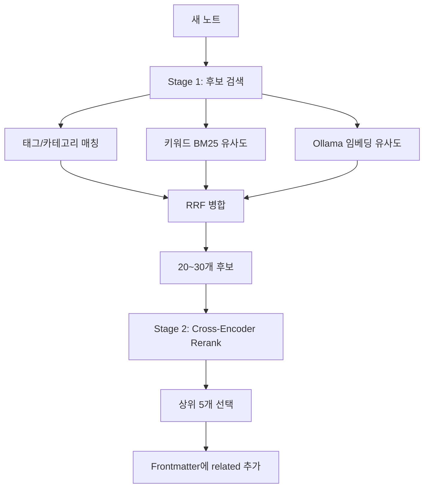
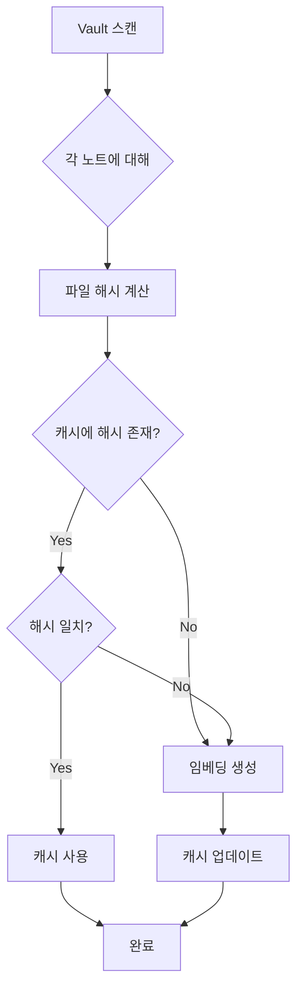
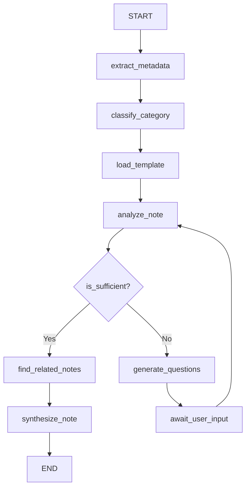
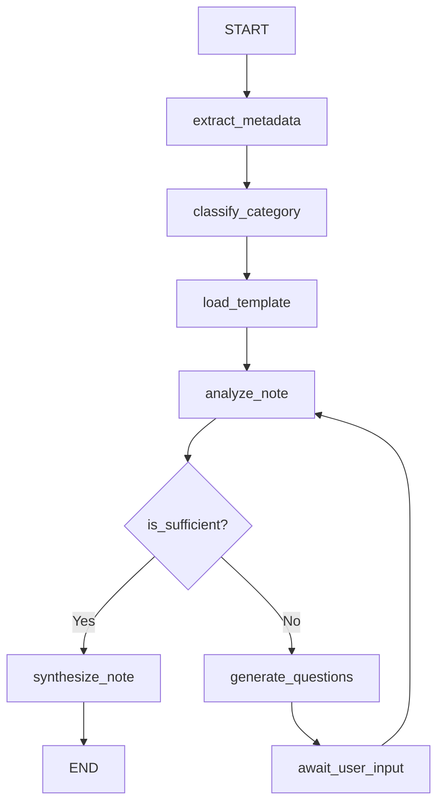
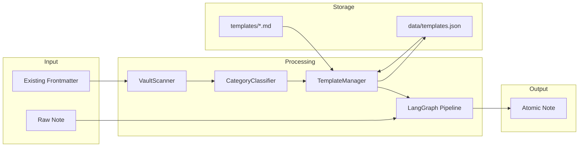

# ANA (Atomic Note Architect) 구현 계획서

원시 노트를 Zettelkasten 원칙에 부합하는 Atomic Note로 변환하는 AI 에이전트를 구현합니다. LangGraph 기반의 3단계 파이프라인(분석 → 심문 → 합성)으로 구축하며, 사용자와의 Interactive Loop를 통해 맥락을 완성합니다.

---

## 추가 요구사항 반영 (2026-01-18)

| 요구사항 | 구현 방안 |
|----------|-----------|
| **1. Frontmatter metadata 활용** | 기존 노트의 모든 Frontmatter 필드를 분석에 활용 |
| **2. 최대 질문 5개** | `MAX_QUESTIONS = 5`로 설정 |
| **3. 카테고리 분류** | Frontmatter `type`/`category` 필드 우선 → 없으면 AI 자동 분류 |
| **4. 템플릿 관리** | 우선순위: 파일(A) → DB(B) → AI생성(C), **B는 항상 저장** |
| **5. 노트 연결 (Wikilink)** | 연관 노트 자동 분석 → Frontmatter `related` 필드에 wikilink 추가 |

---

## 추가 기능: 노트 연결 (Note Linking) - 2026-01-18

### 개요

Atomic 노트 간의 연관성을 분석하여 Frontmatter `related` 필드에 상위 5개 관련 노트의 wikilink를 자동으로 추가합니다.

### 아키텍처: 2-Stage Retrieval + Rerank (무료 로컬)



### 기술 스택 (무료 로컬)

| 컴포넌트 | 선택 | 설명 |
|----------|------|------|
| **임베딩** | Ollama `nomic-embed-text` | 무료 로컬, 다국어 지원 |
| **Reranker** | `sentence-transformers` Cross-Encoder | `ms-marco-MiniLM-L-6-v2` 또는 다국어 모델 |
| **키워드 매칭** | 자체 구현 (TF-IDF/BM25 스타일) | 의존성 최소화 |

### Stage 1: 후보 검색 (Retrieval)

세 가지 방법 **병렬 실행** → **RRF(Reciprocal Rank Fusion)** 병합

| 방법 | 가중치 | 설명 |
|------|--------|------|
| 태그/카테고리 | 0.25 | 명시적 분류 기반 |
| 키워드 유사도 | 0.30 | BM25 스타일 정확 매칭 |
| 임베딩 유사도 | 0.45 | 의미적 유사성 |

**RRF 공식**:
```python
rrf_score = Σ 1/(k + rank_i)  # k=60
```

### Stage 2: Rerank (Cross-Encoder)

후보 20~30개 → Cross-Encoder로 정밀 재순위 → **상위 5개 선택**

```python
from sentence_transformers import CrossEncoder

reranker = CrossEncoder('cross-encoder/ms-marco-MiniLM-L-6-v2')
# 또는 다국어: 'cross-encoder/mmarco-mMiniLMv2-L12-H384-v1'

scores = reranker.predict([(query, doc) for doc in candidates])
top_5 = sorted(zip(candidates, scores), key=lambda x: x[1], reverse=True)[:5]
```

### 임베딩 캐시 전략

#### 저장 위치
임베딩을 **Obsidian Vault 내부**에 저장하여 이식성 확보:
```
vault/
├── .ana/
│   ├── embeddings.json      # 임베딩 벡터 캐시
│   └── embeddings_meta.json # 파일 해시 + 수정 시간
├── notes/
│   └── ...
```

#### 증분 업데이트 로직



#### 캐시 데이터 구조

```json
// embeddings_meta.json - 파일별 메타데이터
{
  "notes/RAG 개념.md": {
    "hash": "a1b2c3d4...",
    "modified": "2026-01-18T14:00:00",
    "embedding_key": "embed_001"
  }
}

// embeddings.json - 실제 임베딩 벡터
{
  "embed_001": [0.123, -0.456, 0.789, ...]
}
```

#### 핵심 메서드

```python
class EmbeddingCache:
    def __init__(self, vault_path: Path):
        self.cache_dir = vault_path / ".ana"
        self.embeddings_file = self.cache_dir / "embeddings.json"
        self.meta_file = self.cache_dir / "embeddings_meta.json"
    
    def get_or_create(self, file_path: Path, content: str) -> list[float]:
        """캐시에서 가져오거나 새로 생성"""
        file_hash = self._compute_hash(content)
        cached_hash = self._get_cached_hash(file_path)
        
        if cached_hash == file_hash:
            return self._load_embedding(file_path)
        
        # 변경됨 → 새로 생성
        embedding = self._create_embedding(content)
        self._save_embedding(file_path, embedding, file_hash)
        return embedding
    
    def _compute_hash(self, content: str) -> str:
        """내용 기반 해시 (MD5)"""
        return hashlib.md5(content.encode()).hexdigest()
    
    def sync_vault(self):
        """Vault 전체 임베딩 동기화 (변경된 것만 업데이트)"""
        updated = 0
        for note in vault_scanner.scan_all_notes():
            content = note["path"].read_text()
            if self._needs_update(note["path"], content):
                self.get_or_create(note["path"], content)
                updated += 1
        return updated
```

#### 장점
- ✅ Vault와 함께 Git으로 버전 관리 가능
- ✅ 변경된 문서만 재임베딩 (효율성)
- ✅ 다른 환경에서도 캐시 재사용 가능

### Frontmatter 출력 형식

```yaml
---
title: "RAG 시스템에서 Hybrid Search가 필요한 이유"
tags: [RAG, Search, AI]
type: concept
created: 2026-01-18
related:
  - "[[검색 증강 생성(RAG) 개념]]"
  - "[[Semantic Search vs Keyword Search]]"
  - "[[LLM 환각 문제 해결 방법]]"
  - "[[Vector Database 비교]]"
  - "[[Chunking 전략]]"
---
```

### 구현 계획

#### [NEW] [src/link_analyzer.py](file:///home/shkim/workspace/04.ANA/src/link_analyzer.py)
2-Stage Retrieval + Rerank 기반 노트 연결 분석기

```python
"""Link Analyzer - 2-Stage Retrieval + Rerank"""
from pathlib import Path
from typing import Any
import math
import hashlib
import json

class LinkAnalyzer:
    """노트 연결 분석기 (2-Stage Retrieval + Rerank)"""
    
    def __init__(
        self,
        vault_scanner,
        ollama_base_url: str = "http://localhost:11434",
        embedding_model: str = "nomic-embed-text",
        rerank_model: str = "cross-encoder/ms-marco-MiniLM-L-6-v2",
        cache_dir: Path = None
    ):
        self.vault_scanner = vault_scanner
        self.ollama_base_url = ollama_base_url
        self.embedding_model = embedding_model
        self.rerank_model = rerank_model
        self.cache_dir = cache_dir or Path("data/embeddings_cache")
        
        # Lazy loading
        self._embedder = None
        self._reranker = None
        self._embedding_cache: dict[str, list[float]] = {}
        self._load_cache()
    
    def find_related_notes(
        self,
        note_title: str,
        note_content: str,
        note_tags: list[str],
        note_category: str,
        max_links: int = 5
    ) -> list[str]:
        """
        관련 노트 찾기 (상위 5개 wikilink 반환)
        
        Stage 1: 태그/카테고리 + 키워드 + 임베딩으로 후보 검색
        Stage 2: Cross-Encoder로 Rerank → 상위 5개 선택
        """
        query = f"{note_title}\n{note_content[:1000]}"
        
        # Stage 1: 후보 검색 (병렬)
        tag_results = self._find_by_tags_category(note_tags, note_category)
        keyword_results = self._find_by_keywords(note_title, note_content)
        embedding_results = self._find_by_embeddings(query)
        
        # RRF 병합
        candidates = self._rrf_merge([
            (tag_results, 0.25),
            (keyword_results, 0.30),
            (embedding_results, 0.45)
        ], top_k=30)
        
        if not candidates:
            return []
        
        # Stage 2: Rerank
        reranked = self._rerank(query, candidates)
        
        # 상위 5개 wikilink 생성
        top_5 = reranked[:max_links]
        return [f'[[{title}]]' for title, _ in top_5]
    
    # =========================================================================
    # Stage 1: Retrieval Methods
    # =========================================================================
    
    def _find_by_tags_category(
        self,
        tags: list[str],
        category: str
    ) -> list[tuple[str, float]]:
        """태그/카테고리 기반 검색"""
        results = []
        
        for note in self.vault_scanner.scan_all_notes():
            title = self._get_title(note)
            meta = note.get("metadata", {})
            score = 0.0
            
            # 태그 매칭
            note_tags = meta.get("tags", [])
            if isinstance(note_tags, list) and tags:
                shared = set(tags) & set(note_tags)
                if shared:
                    score += len(shared) / len(tags) * 0.7
            
            # 카테고리 매칭
            note_cat = meta.get("type") or meta.get("category")
            if note_cat and note_cat == category:
                score += 0.5
            
            if score > 0:
                results.append((title, score))
        
        return sorted(results, key=lambda x: x[1], reverse=True)
    
    def _find_by_keywords(
        self,
        title: str,
        content: str
    ) -> list[tuple[str, float]]:
        """키워드(BM25 스타일) 검색"""
        import re
        
        # 쿼리 키워드 추출
        query_text = f"{title} {content[:500]}"
        query_words = set(re.findall(r'[가-힣]+|[a-zA-Z]+', query_text.lower()))
        stopwords = {'the', 'a', 'an', 'is', 'are', '은', '는', '이', '가', '를', '을', '에', '의'}
        query_words = {w for w in query_words if w not in stopwords and len(w) > 1}
        
        if not query_words:
            return []
        
        results = []
        for note in self.vault_scanner.scan_all_notes():
            note_title = self._get_title(note)
            note_body = self.vault_scanner.get_note_body(note["path"]) or ""
            note_text = f"{note_title} {note_body[:500]}"
            note_words = set(re.findall(r'[가-힣]+|[a-zA-Z]+', note_text.lower()))
            
            overlap = query_words & note_words
            if overlap:
                score = len(overlap) / len(query_words)
                results.append((note_title, score))
        
        return sorted(results, key=lambda x: x[1], reverse=True)
    
    def _find_by_embeddings(self, query: str) -> list[tuple[str, float]]:
        """Ollama 임베딩 유사도 검색"""
        query_vec = self._get_embedding(query)
        if query_vec is None:
            return []
        
        results = []
        for note in self.vault_scanner.scan_all_notes():
            title = self._get_title(note)
            note_content = self.vault_scanner.get_note_content(note["path"]) or ""
            
            doc_vec = self._get_embedding(note_content[:1500], cache_key=str(note["path"]))
            if doc_vec:
                sim = self._cosine_similarity(query_vec, doc_vec)
                results.append((title, sim))
        
        return sorted(results, key=lambda x: x[1], reverse=True)
    
    # =========================================================================
    # RRF Merge
    # =========================================================================
    
    def _rrf_merge(
        self,
        ranked_lists: list[tuple[list[tuple[str, float]], float]],
        top_k: int = 30,
        k: int = 60
    ) -> list[str]:
        """Reciprocal Rank Fusion으로 여러 랭킹 병합"""
        scores = {}
        
        for ranked_list, weight in ranked_lists:
            for rank, (title, _) in enumerate(ranked_list):
                if title not in scores:
                    scores[title] = 0.0
                scores[title] += weight / (k + rank + 1)
        
        sorted_items = sorted(scores.items(), key=lambda x: x[1], reverse=True)
        return [title for title, _ in sorted_items[:top_k]]
    
    # =========================================================================
    # Stage 2: Rerank
    # =========================================================================
    
    def _rerank(self, query: str, candidates: list[str]) -> list[tuple[str, float]]:
        """Cross-Encoder로 후보 재순위"""
        if not candidates:
            return []
        
        reranker = self._get_reranker()
        if reranker is None:
            # Reranker 없으면 원래 순서 유지
            return [(c, 1.0 - i/len(candidates)) for i, c in enumerate(candidates)]
        
        # 각 후보의 내용 가져오기
        pairs = []
        valid_candidates = []
        for title in candidates:
            content = self._get_content_by_title(title)
            if content:
                pairs.append((query, content[:500]))  # 500자 제한
                valid_candidates.append(title)
        
        if not pairs:
            return []
        
        scores = reranker.predict(pairs)
        results = list(zip(valid_candidates, scores))
        return sorted(results, key=lambda x: x[1], reverse=True)
    
    # =========================================================================
    # Helper Methods
    # =========================================================================
    
    def _get_embedding(self, text: str, cache_key: str = None) -> list[float] | None:
        """Ollama로 임베딩 생성 (캐시 사용)"""
        if cache_key is None:
            cache_key = hashlib.md5(text[:500].encode()).hexdigest()
        
        if cache_key in self._embedding_cache:
            return self._embedding_cache[cache_key]
        
        try:
            import requests
            response = requests.post(
                f"{self.ollama_base_url}/api/embeddings",
                json={"model": self.embedding_model, "prompt": text[:1500]},
                timeout=30
            )
            if response.status_code == 200:
                embedding = response.json().get("embedding")
                if embedding:
                    self._embedding_cache[cache_key] = embedding
                    self._save_cache()
                    return embedding
        except Exception:
            pass
        return None
    
    def _get_reranker(self):
        """Cross-Encoder 로드 (lazy loading)"""
        if self._reranker is None:
            try:
                from sentence_transformers import CrossEncoder
                self._reranker = CrossEncoder(self.rerank_model)
            except ImportError:
                return None
        return self._reranker
    
    def _cosine_similarity(self, a: list[float], b: list[float]) -> float:
        """코사인 유사도 계산"""
        dot = sum(x * y for x, y in zip(a, b))
        norm_a = math.sqrt(sum(x * x for x in a))
        norm_b = math.sqrt(sum(x * x for x in b))
        if norm_a == 0 or norm_b == 0:
            return 0.0
        return dot / (norm_a * norm_b)
    
    def _get_title(self, note: dict) -> str:
        """노트 제목 추출"""
        meta = note.get("metadata", {})
        return meta.get("title") or note["path"].stem
    
    def _get_content_by_title(self, title: str) -> str | None:
        """제목으로 노트 내용 검색"""
        for note in self.vault_scanner.scan_all_notes():
            if self._get_title(note) == title:
                return self.vault_scanner.get_note_content(note["path"])
        return None
    
    def _load_cache(self):
        """임베딩 캐시 로드"""
        cache_file = self.cache_dir / "embeddings.json"
        if cache_file.exists():
            try:
                with open(cache_file, "r") as f:
                    self._embedding_cache = json.load(f)
            except:
                pass
    
    def _save_cache(self):
        """임베딩 캐시 저장"""
        self.cache_dir.mkdir(parents=True, exist_ok=True)
        cache_file = self.cache_dir / "embeddings.json"
        try:
            with open(cache_file, "w") as f:
                json.dump(self._embedding_cache, f)
        except:
            pass
```
        # 점수 정규화 (최대 1.0)
        for item in merged.values():
            item["score"] = min(item["score"], 1.0)
            item["reason"] = ", ".join(set(item["reasons"]))
            del item["reasons"]
        
        return list(merged.values())
```

#### [MODIFY] [src/schemas.py](file:///home/shkim/workspace/04.ANA/src/schemas.py)
`DraftNote`에 `related_notes` 필드 추가

```python
class DraftNote(BaseModel):
    title: str
    tags: list[str]
    content: str
    category: str
    frontmatter: dict[str, Any]
    suggested_links: list[str]
    related_notes: list[str] = Field(  # ★ 추가
        default_factory=list,
        description="Related notes as wikilinks"
    )
```

#### [MODIFY] [src/graph.py](file:///home/shkim/workspace/04.ANA/src/graph.py)
합성 단계에 노트 연결 분석 추가



#### [MODIFY] [src/agent.py](file:///home/shkim/workspace/04.ANA/src/agent.py)
`LinkAnalyzer` 통합

```python
class AtomicNoteArchitect:
    def __init__(self, config: ANAConfig = None):
        # ... 기존 코드 ...
        self.link_analyzer = LinkAnalyzer(
            self.vault_scanner,
            self.llm,
            embeddings=None  # 선택적
        )
```

#### [MODIFY] [src/config.py](file:///home/shkim/workspace/04.ANA/src/config.py)
연결 관련 설정 추가

```python
class ANAConfig(BaseSettings):
    # ... 기존 설정 ...
    
    # 노트 연결 설정
    max_related_links: int = 5      # 최대 관련 노트 수
    min_link_score: float = 0.3     # 최소 연관도 점수
    use_embeddings: bool = False    # 임베딩 유사도 사용 여부
```

### 선택적 확장: 임베딩 기반 유사도

#### [NEW] [src/embeddings.py](file:///home/shkim/workspace/04.ANA/src/embeddings.py)
임베딩 벡터 생성 및 캐시 관리 (선택적)

```python
class EmbeddingManager:
    """임베딩 벡터 관리"""
    
    def __init__(self, config: ANAConfig):
        self.cache_path = config.data_dir / "embeddings_cache.json"
        self._cache: dict[str, list[float]] = self._load_cache()
        self._embedder = self._get_embedder(config)
    
    def get_embedding(self, text: str) -> list[float]:
        """텍스트의 임베딩 벡터 반환 (캐시 활용)"""
        cache_key = hashlib.md5(text.encode()).hexdigest()
        if cache_key in self._cache:
            return self._cache[cache_key]
        
        embedding = self._embedder.embed_query(text)
        self._cache[cache_key] = embedding
        self._save_cache()
        return embedding
    
    def cosine_similarity(self, vec1: list[float], vec2: list[float]) -> float:
        """코사인 유사도 계산"""
        import numpy as np
        return np.dot(vec1, vec2) / (np.linalg.norm(vec1) * np.linalg.norm(vec2))
```

### 테스트 시나리오

#### 시나리오 6: 관련 노트 자동 연결
- **입력**: "RAG 시스템의 성능 최적화" 라는 노트
- **Vault에 존재하는 노트들**: 
  - "RAG 개념 정리" (tags: [RAG, AI])
  - "LLM 성능 튜닝" (tags: [LLM, 성능])
  - "검색 엔진 최적화" (tags: [Search])
- **기대 결과**: 
  ```yaml
  related:
    - "[[RAG 개념 정리]]"
    - "[[LLM 성능 튜닝]]"
  ```

### 구현 우선순위

| 순서 | 항목 | 복잡도 |
|------|------|--------|
| 1 | `link_analyzer.py` 기본 구현 (태그/카테고리 매칭) | 중 |
| 2 | `schemas.py` 수정 | 낮음 |
| 3 | `graph.py`에 노드 추가 | 중 |
| 4 | `agent.py` 통합 | 중 |
| 5 | (선택) `embeddings.py` 구현 | 높음 |

### 예상 소요 시간
- 기본 구현: **1시간**
- 임베딩 확장: **+30분**


## Proposed Changes

### 1. 프로젝트 구조 및 설정

#### [NEW] [pyproject.toml](file:///home/shkim/workspace/04.ANA/pyproject.toml)
- 프로젝트 메타데이터 및 의존성 정의
- `uv` 패키지 매니저 기반 설정
- 의존성: `langchain`, `langgraph`, `langchain-openai`, `langchain-anthropic`, `langchain-ollama`, `pydantic`, `rich`, `pyyaml`

#### [NEW] [.env.example](file:///home/shkim/workspace/04.ANA/.env.example)
- 환경변수 템플릿 (API 키, LLM 설정 등)

#### [NEW] [README.md](file:///home/shkim/workspace/04.ANA/README.md)
- 프로젝트 개요, 설치 방법, 사용법 문서화

---

### 2. 설정 모듈 (Config)

#### [NEW] [src/config.py](file:///home/shkim/workspace/04.ANA/src/config.py)
Vault 경로, LLM 설정, 에이전트 파라미터를 중앙 관리

```python
from pydantic_settings import BaseSettings
from pathlib import Path

class ANAConfig(BaseSettings):
    """ANA 에이전트 설정"""
    
    # Obsidian Vault 설정
    vault_path: Path = Path("~/vault")
    
    # LLM 설정
    llm_provider: str = "openai"  # openai, anthropic, ollama, vllm
    llm_model: str = "gpt-4o"
    llm_temperature: float = 0.7
    
    # Ollama 설정
    ollama_base_url: str = "http://localhost:11434"
    ollama_model: str = "llama3.1:8b"
    
    # vLLM 설정
    vllm_base_url: str = "http://localhost:8000/v1"
    vllm_model: str = "meta-llama/Llama-3.1-8B-Instruct"
    
    # 에이전트 설정
    max_questions: int = 5  # ★ 최대 질문 개수
    max_iterations: int = 3  # 최대 질문 라운드
    
    # 템플릿 설정
    templates_dir: Path = Path("templates")
    template_db_path: Path = Path("data/templates.json")  # ★ B: DB 저장 경로
    
    class Config:
        env_file = ".env"
        env_prefix = "ANA_"
```

---

### 3. LLM 설정 모듈

#### [NEW] [src/llm_config.py](file:///home/shkim/workspace/04.ANA/src/llm_config.py)
환경변수 기반으로 LLM provider를 유연하게 선택하는 설정 모듈

```python
# 지원하는 providers
- OpenAI (GPT-4o, GPT-4o-mini)
- Anthropic (Claude 3.5 Sonnet)
- Ollama (llama3.1, qwen2.5, gemma2)
- vLLM (OpenAI 호환 API)
```

**주요 기능**:
- `get_llm(config: ANAConfig)`: 설정에 따라 적절한 LLM 인스턴스 반환
- 온도, max_tokens 등 파라미터 조정 지원

---

### 4. Vault 스캐너 (Metadata 수집)

#### [NEW] [src/vault_scanner.py](file:///home/shkim/workspace/04.ANA/src/vault_scanner.py)
기존 Obsidian 노트의 Frontmatter 메타데이터 수집 및 분석

```python
from pathlib import Path
import yaml

class VaultScanner:
    """Obsidian Vault 스캐너"""
    
    def __init__(self, vault_path: Path):
        self.vault_path = vault_path
        self._cache: dict[str, dict] = {}
    
    def scan_all_notes(self) -> list[dict]:
        """모든 노트의 Frontmatter 스캔"""
        notes = []
        for md_file in self.vault_path.rglob("*.md"):
            metadata = self.extract_frontmatter(md_file)
            if metadata:
                notes.append({
                    "path": md_file,
                    "metadata": metadata
                })
        return notes
    
    def extract_frontmatter(self, file_path: Path) -> dict | None:
        """단일 파일의 Frontmatter 추출"""
        content = file_path.read_text(encoding="utf-8")
        if content.startswith("---"):
            end = content.find("---", 3)
            if end != -1:
                yaml_str = content[3:end]
                return yaml.safe_load(yaml_str)
        return None
    
    def get_existing_categories(self) -> set[str]:
        """기존 노트들의 카테고리 목록 추출"""
        categories = set()
        for note in self.scan_all_notes():
            meta = note["metadata"]
            # type, category, tags 등에서 카테고리 추출
            if "type" in meta:
                categories.add(meta["type"])
            if "category" in meta:
                categories.add(meta["category"])
        return categories
    
    def find_similar_notes(self, category: str) -> list[Path]:
        """같은 카테고리의 노트 찾기"""
        similar = []
        for note in self.scan_all_notes():
            meta = note["metadata"]
            if meta.get("type") == category or meta.get("category") == category:
                similar.append(note["path"])
        return similar
```

---

### 5. 카테고리 분류기

#### [NEW] [src/category_classifier.py](file:///home/shkim/workspace/04.ANA/src/category_classifier.py)
Frontmatter 기반 + AI 자동 분류

```python
class CategoryClassifier:
    """카테고리 분류기"""
    
    def __init__(self, vault_scanner: VaultScanner, llm):
        self.vault_scanner = vault_scanner
        self.llm = llm
        self.existing_categories = vault_scanner.get_existing_categories()
    
    def classify(self, raw_note: str, frontmatter: dict | None = None) -> str:
        """
        카테고리 분류 로직:
        1. Frontmatter에 type/category가 있으면 사용
        2. 없으면 AI가 기존 카테고리 중에서 선택
        3. 기존 카테고리에도 없으면 AI가 새 카테고리 제안
        """
        # Step 1: Frontmatter 확인
        if frontmatter:
            if "type" in frontmatter:
                return frontmatter["type"]
            if "category" in frontmatter:
                return frontmatter["category"]
        
        # Step 2: AI 분류 (기존 카테고리 제공)
        return self._ai_classify(raw_note)
    
    def _ai_classify(self, raw_note: str) -> str:
        """AI를 사용한 카테고리 분류"""
        prompt = f"""
다음 노트의 카테고리를 분류해주세요.

기존 카테고리 목록: {list(self.existing_categories)}

노트 내용:
{raw_note}

위 기존 카테고리 중 적합한 것이 있으면 그것을 반환하고,
없으면 새로운 카테고리 이름을 제안해주세요.
카테고리 이름만 반환하세요.
"""
        response = self.llm.invoke(prompt)
        return response.content.strip()
```

---

### 6. 템플릿 매니저

#### [NEW] [src/template_manager.py](file:///home/shkim/workspace/04.ANA/src/template_manager.py)
카테고리별 노트 템플릿 관리 (A → B → C 우선순위, B 항상 저장)

```python
from pathlib import Path
import json

class TemplateManager:
    """
    템플릿 관리자
    
    우선순위:
    A. 파일 기반 (templates/{category}_template.md)
    B. DB 기반 (data/templates.json) - ★ 항상 저장
    C. AI 동적 생성
    
    한 가지만 실행되며, B는 항상 저장됨
    """
    
    def __init__(self, config: ANAConfig, llm):
        self.templates_dir = config.templates_dir
        self.db_path = config.template_db_path
        self.llm = llm
        self._db: dict = self._load_db()
    
    def get_template(self, category: str, sample_notes: list[Path] = None) -> str:
        """
        카테고리에 맞는 템플릿 반환
        A → B → C 순서로 시도, B에는 항상 저장
        """
        template = None
        source = None
        
        # A: 파일 기반 템플릿 확인
        file_template = self._get_file_template(category)
        if file_template:
            template = file_template
            source = "file"
        
        # B: DB 기반 템플릿 확인 (A가 없을 때만)
        if template is None:
            db_template = self._get_db_template(category)
            if db_template:
                template = db_template
                source = "db"
        
        # C: AI 동적 생성 (A, B 둘 다 없을 때만)
        if template is None:
            template = self._generate_template_with_ai(category, sample_notes)
            source = "ai"
        
        # ★ B에 항상 저장 (source가 file이든 ai든)
        self._save_to_db(category, template)
        
        return template
    
    def _get_file_template(self, category: str) -> str | None:
        """A: 파일 기반 템플릿 조회"""
        template_file = self.templates_dir / f"{category}_template.md"
        if template_file.exists():
            return template_file.read_text(encoding="utf-8")
        return None
    
    def _get_db_template(self, category: str) -> str | None:
        """B: DB 기반 템플릿 조회"""
        return self._db.get(category)
    
    def _generate_template_with_ai(self, category: str, sample_notes: list[Path] = None) -> str:
        """C: AI를 사용한 템플릿 동적 생성"""
        samples_text = ""
        if sample_notes:
            for note_path in sample_notes[:3]:  # 최대 3개 샘플
                samples_text += f"\n--- Sample ---\n{note_path.read_text()}\n"
        
        prompt = f"""
카테고리 '{category}'에 적합한 Obsidian 노트 템플릿을 생성해주세요.

{f"참고할 기존 노트 샘플:{samples_text}" if samples_text else ""}

템플릿 요구사항:
1. YAML Frontmatter 포함 (title, tags, created, type 필수)
2. 카테고리에 적합한 섹션 구조
3. Jinja2 템플릿 문법 사용 ({{{{ variable }}}})
4. Related Links 섹션 포함

Markdown 템플릿만 반환하세요.
"""
        response = self.llm.invoke(prompt)
        return response.content.strip()
    
    def _save_to_db(self, category: str, template: str):
        """B: DB에 템플릿 저장 (항상 실행)"""
        self._db[category] = template
        self.db_path.parent.mkdir(parents=True, exist_ok=True)
        with open(self.db_path, "w", encoding="utf-8") as f:
            json.dump(self._db, f, ensure_ascii=False, indent=2)
    
    def _load_db(self) -> dict:
        """DB 로드"""
        if self.db_path.exists():
            with open(self.db_path, "r", encoding="utf-8") as f:
                return json.load(f)
        return {}
    
    def propose_new_template(self, category: str) -> str:
        """새 카테고리에 대한 템플릿 제안 (사용자 확인용)"""
        template = self._generate_template_with_ai(category)
        return f"""
## 새 카테고리 '{category}' 템플릿 제안

다음 템플릿을 사용할까요?

```markdown
{template}
```

(y: 사용, n: 수정, c: 취소)
"""
```

---

### 7. 데이터 스키마

#### [NEW] [src/schemas.py](file:///home/shkim/workspace/04.ANA/src/schemas.py)
Pydantic 모델로 입출력 스키마 정의

```python
from pydantic import BaseModel, Field
from typing import Literal, Optional, Any
from typing_extensions import TypedDict

class AnalysisResult(BaseModel):
    """Phase 1 분석 결과"""
    detected_concepts: list[str]      # 감지된 개념들
    missing_context: list[str]        # 누락된 맥락
    is_sufficient: bool               # 충분한 정보량 여부
    detected_category: str | None     # 감지된 카테고리
    existing_metadata: dict[str, Any] # ★ 기존 Frontmatter 메타데이터

class InteractionPayload(BaseModel):
    """Phase 2 질문 생성 결과"""
    questions_to_user: list[str] = Field(
        ..., 
        max_length=5  # ★ 최대 5개
    )
    question_categories: list[str]    # 질문 카테고리 (context/relation/clarification)

class DraftNote(BaseModel):
    """초안 노트"""
    title: str
    tags: list[str]
    content: str
    category: str                     # ★ 카테고리
    frontmatter: dict[str, Any]       # ★ 전체 Frontmatter (기존 + 신규)
    suggested_links: list[str]        # 연결 제안

class AgentResponse(BaseModel):
    """에이전트 전체 응답"""
    status: Literal["needs_info", "completed"]
    analysis: AnalysisResult
    interaction: Optional[InteractionPayload]
    draft_note: DraftNote
    template_used: str                # ★ 사용된 템플릿 소스 (file/db/ai)

class AgentState(TypedDict):
    """LangGraph 상태"""
    raw_note: str
    input_metadata: dict              # ★ 입력 노트의 기존 메타데이터
    user_answers: list[str]
    analysis: Optional[AnalysisResult]
    questions: Optional[InteractionPayload]
    category: str                     # ★ 분류된 카테고리
    template: str                     # ★ 사용할 템플릿
    final_note: Optional[DraftNote]
    iteration_count: int
```

---

### 8. 프롬프트 정의

#### [NEW] [src/prompts.py](file:///home/shkim/workspace/04.ANA/src/prompts.py)
각 Phase별 시스템 프롬프트 정의

**포함 프롬프트**:
1. `SYSTEM_PROMPT`: 지식 아키텍트 역할 정의
2. `ANALYSIS_PROMPT`: Phase 1 분석용 (메타데이터 활용)
3. `INTERROGATION_PROMPT`: Phase 2 질문 생성용 (최대 5개)
4. `SYNTHESIS_PROMPT`: Phase 3 합성용 (템플릿 적용)
5. `CATEGORY_PROMPT`: 카테고리 분류용
6. `TEMPLATE_GENERATION_PROMPT`: 템플릿 생성용

```python
SYSTEM_PROMPT = """
당신은 엄격하고 통찰력 있는 '지식 아키텍트(Knowledge Architect)'입니다.
사용자의 거친 메모를 영구 보존 가치가 있는 'Atomic Note'로 변환하십시오.

Rules:
1. 원자성(Atomicity): 여러 주제가 섞여 있다면 n개의 노트로 분리 제안
2. 적극적 개입(Proactive Inquiry): 암묵지를 글로 꺼내기
3. 재작성(Rewrite): 답변을 본문에 자연스럽게 통합
4. 형식(Format): Obsidian 호환 Markdown 준수
5. 메타데이터 보존: 기존 Frontmatter 정보를 최대한 활용 및 보존
"""

INTERROGATION_PROMPT = """
다음 노트에서 부족한 맥락을 파악하고 최대 5개의 질문을 생성하세요.

기존 메타데이터:
{existing_metadata}

노트 내용:
{raw_note}

질문 카테고리:
1. 맥락(Context): 왜 중요한지, 어떤 문제를 해결하려는지
2. 관계(Relation): 기존 지식/프로젝트와의 연결
3. 구체화(Clarification): 모호한 용어나 개념의 명확화

최대 5개의 핵심 질문을 생성하세요.
"""
```

---

### 9. LangGraph 워크플로우

#### [NEW] [src/graph.py](file:///home/shkim/workspace/04.ANA/src/graph.py)
LangGraph 기반 확장된 파이프라인 구현



**노드 정의**:

| 노드 | 기능 | 입력 | 출력 |
|------|------|------|------|
| `extract_metadata` | 입력 노트의 Frontmatter 추출 | raw_note | input_metadata |
| `classify_category` | 카테고리 분류 (Frontmatter → AI) | raw_note, metadata | category |
| `load_template` | 템플릿 로드 (A→B→C, B 저장) | category | template |
| `analyze_note` | 원시 노트 분석, 개념 분리, 정보 충분성 판단 | raw_note, metadata | AnalysisResult |
| `generate_questions` | 맥락/관계/구체화 질문 생성 (최대 5개) | AnalysisResult | InteractionPayload |
| `await_user_input` | 사용자 응답 대기 (Human-in-Loop) | questions | user_answers |
| `synthesize_note` | 템플릿 적용하여 최종 Atomic Note 생성 | raw_note + answers + template | DraftNote |

**Edge 조건**:
```python
def should_ask_questions(state: AgentState) -> str:
    if state["analysis"].is_sufficient:
        return "synthesize_note"
    if state["iteration_count"] >= 3:  # 최대 3회 질문 라운드
        return "synthesize_note"
    return "generate_questions"
```

---

### 10. 에이전트 로직

#### [NEW] [src/agent.py](file:///home/shkim/workspace/04.ANA/src/agent.py)
LangGraph 그래프 래핑 및 실행 인터페이스

```python
class AtomicNoteArchitect:
    """ANA 에이전트 메인 클래스"""
    
    def __init__(self, config: ANAConfig = None):
        self.config = config or ANAConfig()
        self.llm = get_llm(self.config)
        self.vault_scanner = VaultScanner(self.config.vault_path)
        self.category_classifier = CategoryClassifier(self.vault_scanner, self.llm)
        self.template_manager = TemplateManager(self.config, self.llm)
        self.graph = build_graph(self)
    
    def process(self, raw_note: str) -> AgentResponse:
        """원시 노트를 처리하여 Atomic Note 생성"""
        pass
    
    def answer_questions(self, answers: list[str]) -> AgentResponse:
        """사용자 답변을 받아 처리 계속"""
        pass
    
    def save_note(self, note: DraftNote, output_dir: Path = None) -> Path:
        """최종 노트를 Markdown 파일로 저장"""
        output_dir = output_dir or self.config.vault_path
        pass
```

---

### 11. CLI 인터페이스

#### [NEW] [src/main.py](file:///home/shkim/workspace/04.ANA/src/main.py)
대화형 CLI 인터페이스 구현

**기능**:
- 원시 노트 입력 (직접 입력 또는 파일 경로)
- 질문에 대한 답변 입력 (최대 5개)
- 카테고리 확인 및 새 템플릿 제안 확인
- 최종 노트 미리보기 및 저장
- `rich` 라이브러리로 보기 좋은 출력

```bash
# 사용 예시
python -m src.main

# 파일에서 입력
python -m src.main --input raw_note.txt

# 설정 파일 지정
python -m src.main --config custom_config.env
```

---

### 12. 유틸리티

#### [NEW] [src/utils.py](file:///home/shkim/workspace/04.ANA/src/utils.py)
- `load_note_from_file()`: 파일에서 노트 로드
- `save_note_to_file()`: Markdown 파일로 저장
- `render_note_preview()`: 터미널에서 노트 미리보기
- `generate_frontmatter()`: YAML frontmatter 생성
- `merge_metadata()`: 기존 + 신규 메타데이터 병합

#### [NEW] [src/__init__.py](file:///home/shkim/workspace/04.ANA/src/__init__.py)
- 패키지 초기화
- 버전 정보

---

### 13. 템플릿 & 데이터

#### [NEW] [templates/default_template.md](file:///home/shkim/workspace/04.ANA/templates/default_template.md)
기본 Atomic Note 출력 템플릿

```markdown
---
title: "{{ title }}"
tags: {{ tags }}
type: {{ category }}
created: {{ created }}
source: "ANA-generated"

{{ key }}: {{ value }}

---

# {{ title }}

{{ content }}

---

## Related Links

- [[{{ link }}]]

```

#### [NEW] [data/templates.json](file:///home/shkim/workspace/04.ANA/data/templates.json)
템플릿 DB 초기 파일

```json
{}
```

---

## File Summary

| 파일 | 역할 | 우선순위 |
|------|------|----------|
| `pyproject.toml` | 프로젝트 설정, 의존성 | 1 |
| `src/config.py` | 설정 관리 (Vault 경로 등) | 2 |
| `src/llm_config.py` | LLM provider 설정 | 3 |
| `src/schemas.py` | 데이터 모델 정의 | 4 |
| `src/vault_scanner.py` | Vault 메타데이터 스캔 | 5 |
| `src/category_classifier.py` | 카테고리 분류 | 6 |
| `src/template_manager.py` | 템플릿 관리 (A→B→C) | 7 |
| `src/prompts.py` | 시스템 프롬프트 | 8 |
| `src/graph.py` | LangGraph 워크플로우 | 9 |
| `src/agent.py` | 에이전트 클래스 | 10 |
| `src/utils.py` | 유틸리티 함수 | 11 |
| `src/main.py` | CLI 진입점 | 12 |
| `templates/default_template.md` | 기본 템플릿 | 13 |
| `data/templates.json` | 템플릿 DB | 14 |

---

## Architecture Diagram



---

## Verification Plan

### Automated Tests

#### 단위 테스트
```bash
# 스키마 검증
uv run pytest tests/test_schemas.py -v

# 설정 테스트
uv run pytest tests/test_config.py -v

# Vault 스캐너 테스트
uv run pytest tests/test_vault_scanner.py -v

# 카테고리 분류 테스트
uv run pytest tests/test_category_classifier.py -v

# 템플릿 매니저 테스트
uv run pytest tests/test_template_manager.py -v

# 그래프 노드 개별 테스트
uv run pytest tests/test_graph_nodes.py -v
```

#### 통합 테스트
```bash
# 전체 파이프라인 테스트
uv run pytest tests/test_integration.py -v
```

### Manual Verification

#### 테스트 시나리오 1: 단일 개념 노트
- **입력**: "RAG는 검색 증강 생성의 약자다"
- **기대 결과**: 질문 없이 바로 완성된 노트 출력

#### 테스트 시나리오 2: 복합 개념 노트
- **입력**: "RAG와 Fine-tuning을 비교했다. 둘 다 장단점이 있다."
- **기대 결과**: 2개의 노트로 분리 제안

#### 테스트 시나리오 3: 맥락 부족 노트
- **입력**: "이 방법이 더 효율적이다"
- **기대 결과**: 최대 5개의 질문 생성

#### 테스트 시나리오 4: 기존 메타데이터 활용
- **입력**: Frontmatter가 있는 기존 노트
- **기대 결과**: 기존 메타데이터 보존 + 신규 정보 추가

#### 테스트 시나리오 5: 새 카테고리 템플릿 생성
- **입력**: 기존에 없는 카테고리의 노트
- **기대 결과**: AI가 템플릿 생성 → DB에 저장

### E2E 테스트
```bash
# 실제 노트로 전체 흐름 테스트
python -m src.main --input examples/sample_note.txt
```

---

## Implementation Timeline

| Phase | 작업 | 예상 시간 |
|-------|------|-----------|
| **1** | 프로젝트 설정 (`pyproject.toml`, `config.py`) | 15분 |
| **2** | 스키마 정의 (`schemas.py`) | 15분 |
| **3** | LLM 설정 (`llm_config.py`) | 15분 |
| **4** | Vault 스캐너 (`vault_scanner.py`) | 20분 |
| **5** | 카테고리 분류기 (`category_classifier.py`) | 20분 |
| **6** | 템플릿 매니저 (`template_manager.py`) | 30분 |
| **7** | 프롬프트 정의 (`prompts.py`) | 20분 |
| **8** | 그래프 구현 (`graph.py`) | 45분 |
| **9** | 에이전트 래퍼 (`agent.py`) | 25분 |
| **10** | CLI 구현 (`main.py`, `utils.py`) | 30분 |
| **11** | 테스트 작성 및 검증 | 40분 |

**Total**: 약 4.5시간
